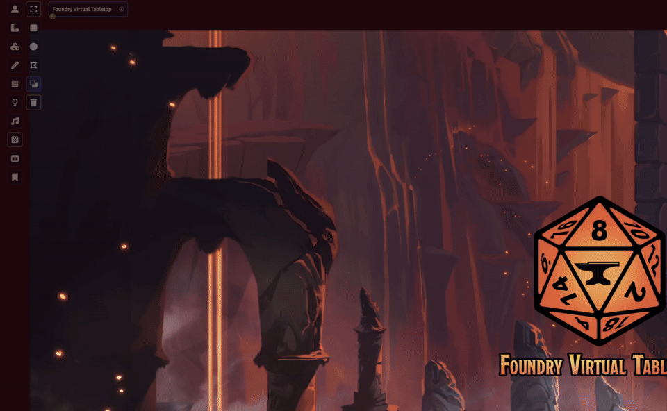

# Sephral’s File Commander

Sephral’s File Commander is a two-pane file manager for Foundry VTT with a classic commander-style workflow. It uses Foundry’s own storage APIs so browsing, copying, uploads, and directory creation stay portable across Windows, Linux, macOS, and hosted setups.

## Discord

Questions, feedback, and module support are welcome on [Discord](https://discord.gg/7BjCgDYaBP).

## Demo

If the embedded preview is not available in your GitHub view, please check the media folder.

## Current feature set

- Two-pane browser for Foundry storages such as `data`, `public`, and `s3`
- Commander-style keyboard navigation with arrow keys, `Enter`, `Tab`, `Backspace`, and `F3`
- Recursive copy from one pane to the other
- Directory creation in writable storages
- Local upload into the active pane
- Direct access from Foundry settings and a scene-control icon on the left side

## Settings

- `Open File Commander` opens the commander directly from module settings
- `Restore last session` remembers pane state between openings
- `Show scene control button` toggles the left-side scene-control icon
- `Default left source` and `Default right source` define the initial storages when no prior session is restored

## Intentional limits of this version

Foundry core exposes browse, upload, and directory creation APIs, but it does not expose equivalent safe client APIs for delete, move, or rename operations in a world session. This module therefore starts with safe, portable commands that work everywhere Foundry runs.

## Hotkeys inside the commander

- `ArrowUp` / `ArrowDown` move the selection
- `ArrowLeft` or `Backspace` go to the parent directory
- `ArrowRight` or `Enter` open the selected directory or file
- `F3` views the selected entry
- `Tab` switches the active pane
- `Ctrl+R` refreshes both panes
- `F5` copies the selected entry to the opposite pane
- `F7` creates a directory in the active pane
- `Ctrl+U` uploads files into the active pane
